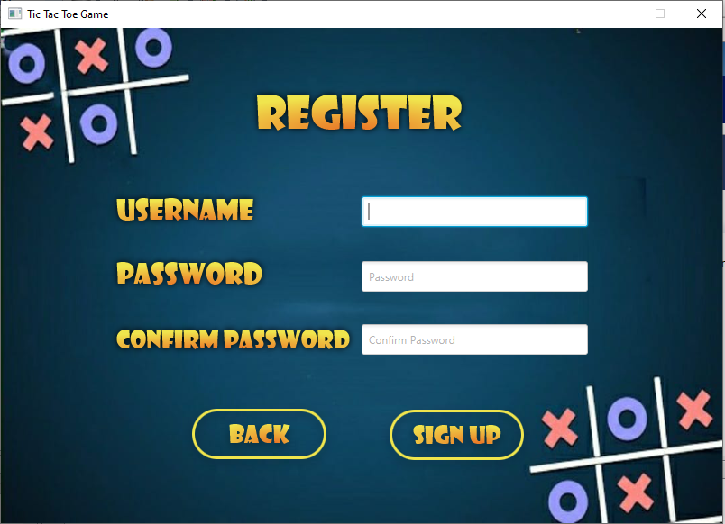
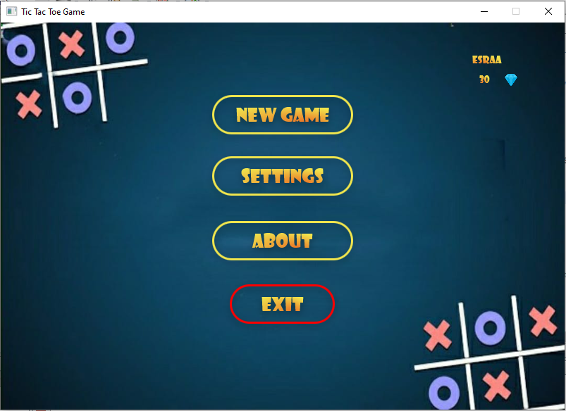
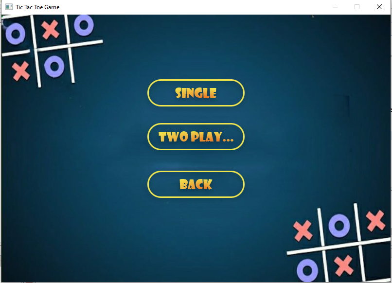
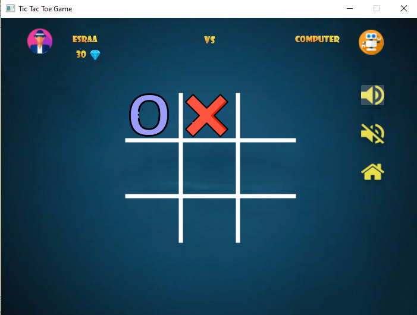
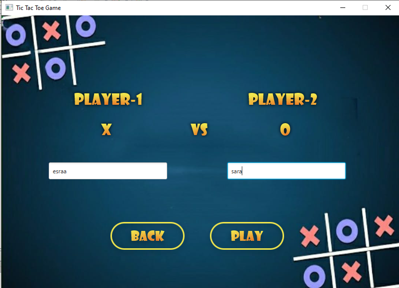
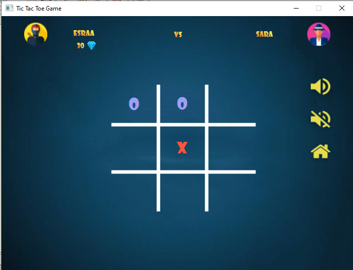
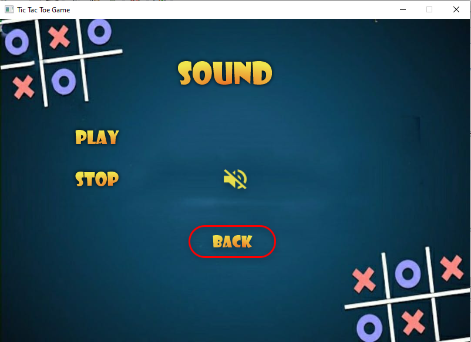

# JAVA Project (XO Game)
 How to run the application:
### Setting up the DB: 
Create MySQL database called "TIC_TAC_TOE_DB"  
Default credentials: DB_USER="root" , DB_PASSWORD="" you might Change it 

Import from source code:
> /DataBase/TIC_TAC_TOE_DB.sql
directly to your database.

### Starting the server:
Kindly use the JAR file of the server.

### Play the game!
Launch any number you want of clients but keep in mind to sign up first before trying to sign in with an account.

## Team Members:
*[Mohamed Ashraf Mohamed Mohamed](www.linkedin.com/in/mohamed-elbermawy-b99954b8) 
*[Ahmed Elbaiomy mahmoud salem](https://www.linkedin.com/in/ahmed-elbaiomy-976553114/) 
*[Hebat Allah Ayman](https://www.linkedin.com/in/heba-elmasry-091635111) 
*[Esraa Mohamed Taha Farhat](https://www.linkedin.com/in/esraa-farhat-e1997)  
*[Islam Ahmed Abdou](https://www.linkedin.com/in/islam-ahmed-265872187)  

## Game Images :
 
 
 
 
 
 
 
 
 
 